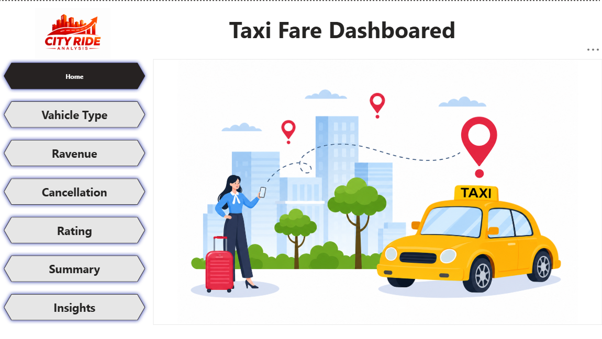
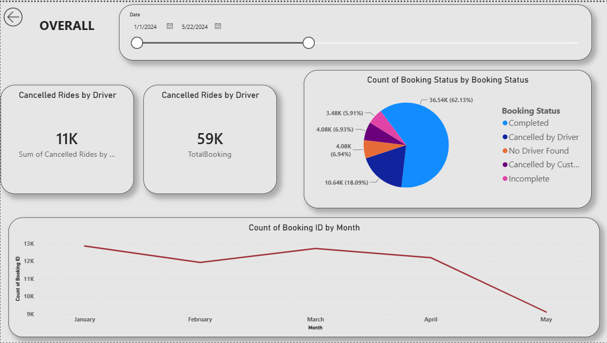
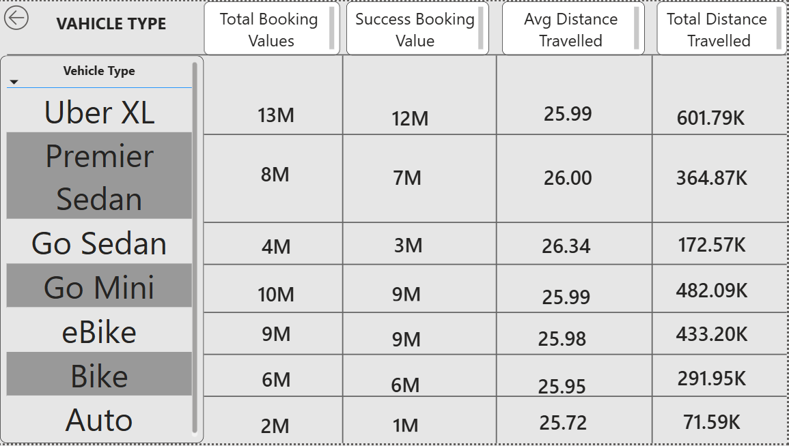
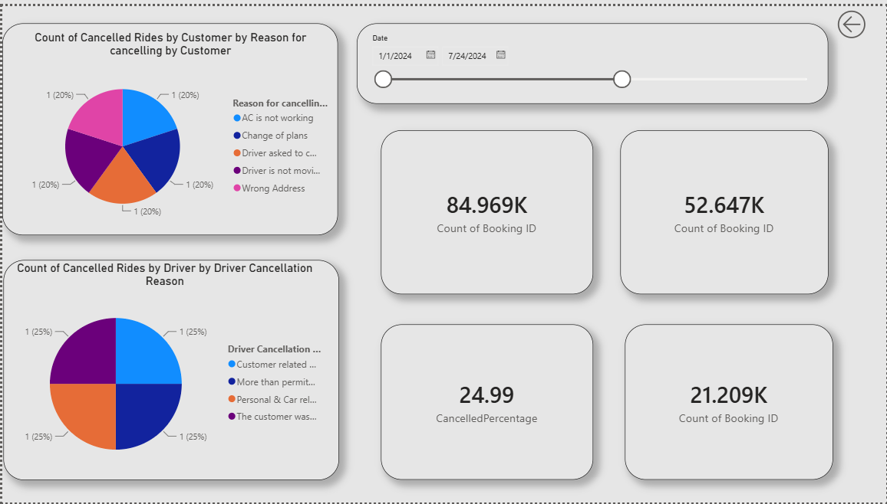
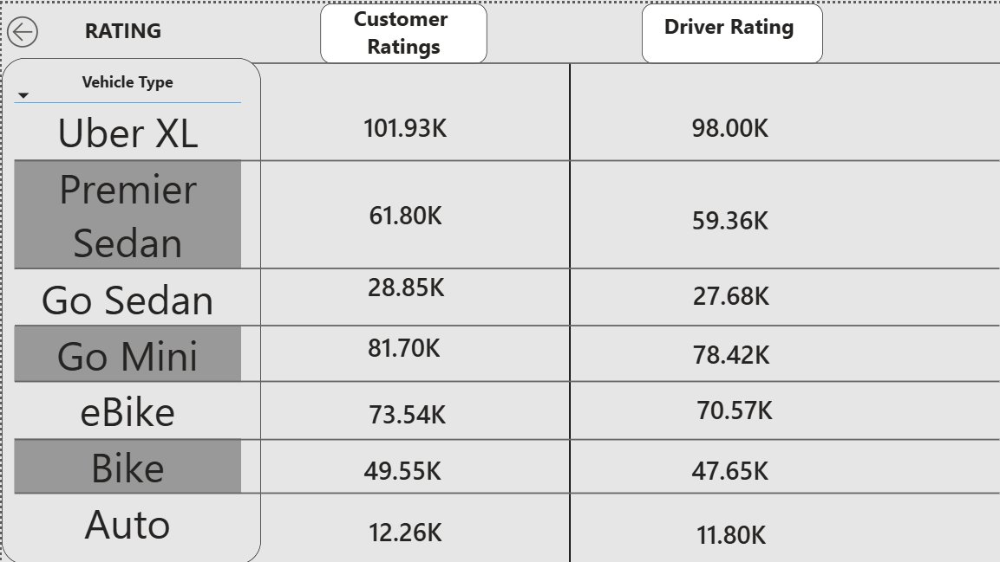
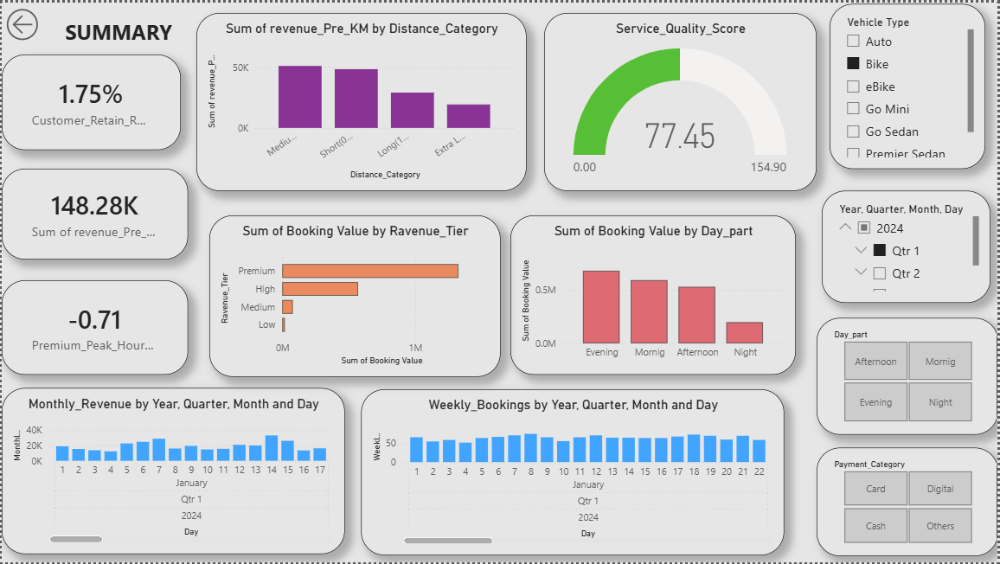

# Taxi Fare Dashboard — Analysis Report

**Project:** Taxi Fare Dashboard..........
**Tool:** Power BI......
**Pages:** Overall | Vehicle Type | Cancellation | Rating | Summary..........

---

## 1. Overview

This dashboard tracks ride bookings for a multi-vehicle taxi/mobility platform (Auto, Bike, eBike, Go Mini, Go Sedan, Premier Sedan, Uber XL) across January–May 2024. It's built as a Six-page interactive report covering booking volume and status, vehicle-level performance, cancellation behavior, customerordriver ratings, and a revenueorKPI summary.

### Overall

- Total bookings sit around **59K**, with a booking status split of: **Completed 62.13%**, **Cancelled by Driver 18.09%**, **No Driver Found 6.94%**, **Cancelled by Customer 6.93%**, and **Incomplete 5.91%**.
- The monthly trend line (Jan–May) is fairly flat through Q1 (~12–13K bookings/month) before dropping sharply into April and May — worth flagging since May's data may be a partial month rather than a true decline.

### Vehicle Type

- **Uber XL** leads in raw volume (13M total booking value, 12M successful), followed by **Go Mini** (10M/9M) and **eBike** (9M/9M).
- **Auto** is the clear laggard: only 2M total value converting to 1M successful — roughly a **50% success rate**, far below every other category.
- **eBike** and **Bike** convert almost 1:1 (total ≈ success), suggesting these are the most reliably fulfilled ride types, even though they're not the top revenue generators.
- Average distance travelled is tightly clustered around **26 km** across all vehicle types — this is a fairly homogeneous distance profile, not a segment where short-hop vs long-haul vehicles are differentiated.

### Cancellation

- Cancelled-by-customer volume (84.969K, 52.647K in the KPI cards) is presented alongside a **~25% cancellation rate**.
- The two reason-breakdown pie charts (customer cancellation reasons, driver cancellation reasons) show perfectly even splits — 20% each across 5 customer reasons, 25% each across 4 driver reasons. That even split is a signal worth double-checking in the data model (see Insight #5 below).

### Rating

- Ratings are shown by vehicle type as aggregated volumes rather than average scores (e.g., Uber XL: 101.93K customer / 98.00K driver).
- Every single vehicle type shows **driver rating slightly below customer rating**, with a highly consistent gap (~2–4K, or roughly 2-4%).

### Summary

- **Customer Retention Rate: 1.75%**
- **Revenue per KM (sum): 148.28K**
- Revenue by distance category peaks at **Medium**, ahead of Short, Long, and Extra Long.
- Booking value is heavily concentrated in the **Premium** revenue tier, dwarfing High/Medium/Low.
- Evening is the strongest day-part for booking value, followed closely by Morning and Afternoon, with Night trailing well behind.
- The Service Quality Score gauge reads **77.45 out of a 154.90 max** — effectively landing at the midpoint of its scale.

---

## 3. Insights 

**1. Driver-side supply is the primary bottleneck, not customer demand.**

**2. Auto is structurally underperforming and dragging down platform reliability.**

**3. Retention is critically low relative to booking volume — the business is running on constant new-customer acquisition.**

**4. Driver ratings are consistently and uniformly lower than customer ratings — a systemic pattern, not a vehicle-specific one.**

**5. The cancellation-reason charts likely reflect a data granularity issue, not real-world behavior.**

**6. Revenue concentration in Medium-distance, Premium-tier, Evening rides suggests an opportunity to rebalance pricing/dispatch around off-peak and non-Premium segments.**

